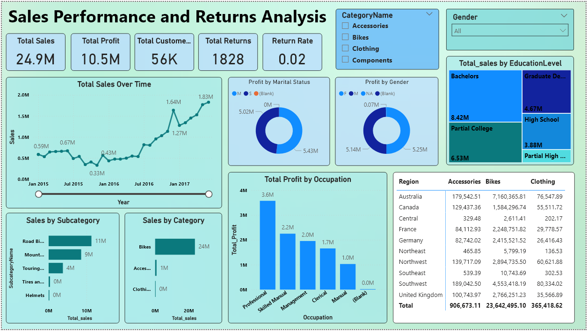
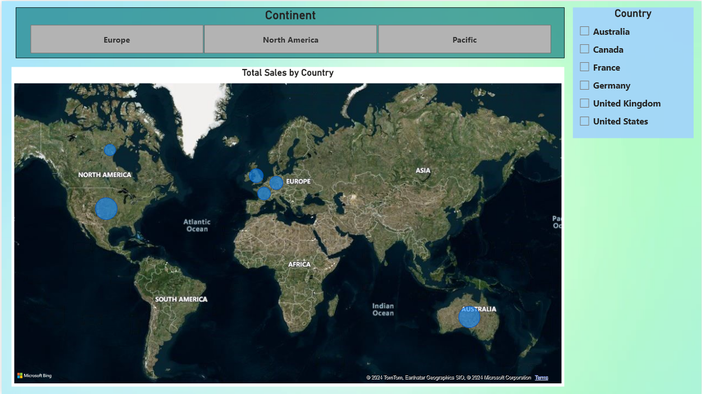

# Sales and Returns Analysis with Power BI

This project showcases an end-to-end data analysis workflow, including data cleaning, feature engineering, DAX queries, and interactive dashboard creation using Power BI. The goal is to analyze sales performance, customer insights, and product returns.

---

## 🚀 **Project Overview**

### Key Objectives:
1. Analyze **sales performance** across regions, products, and customer demographics.
2. Identify **products with the highest return rates** and their financial impact.
3. Provide actionable insights through an interactive **Power BI dashboard**.

---

## 📊 **Dataset**

### Tables Used:
- **Calendar**: Date-related attributes for analysis.
- **Customers**: Demographic and financial information about customers.
- **Products**: Details of products (e.g., price, cost, and category).
- **Product Categories**: Hierarchical data for product categories.
- **Sales**: Transactional data with order and quantity details.
- **Territories**: Geographical data for sales regions.
- **Returns**: Return transactions with quantity details.

---

## 🔧 **Key Features**

1. **Data Cleaning**:
   - Removed null values and duplicate entries.
   - Standardized column names and formats.

2. **Feature Engineering**:
   - Created calculated columns and measures using DAX for insights like:
     - **Total Sales**: Total revenue generated.
     - **Total Profit**: Profit earned after deducting costs.
     - **Return Rate**: Percentage of returns per product.
     - **Average Order Value**: Sales divided by distinct orders.

3. **Data Analysis**:
   - Explored trends across regions, customer income groups, and product categories.
   - Visualized sales vs. returns for decision-making.

4. **Power BI Dashboard**:
   - Interactive visuals including bar charts, clustered bar charts, and line graphs.
   - Filters for dynamic data exploration.

---

## 📈 **Dashboard Highlights**

### Key Visualizations:
1. **Products with the Highest Return Quantities**:
   - A clustered bar chart showcasing the top products by returns.
2. **Annual Income vs. Total Purchases**:
   - A bar chart analyzing the relationship between customer income and purchases.
3. **Profit Trends by Region**:
   - A line chart displaying regional profit trends over time.
4. **Sales by Product Categories**:
   - A pie chart for product category distribution.

### Screenshot:



---

## 📜 **DAX Queries**

### Example DAX Measures:
1. **Total Sales**:
```DAX
   Total Sales = SUMX(
       Sales,
       Sales[OrderQuantity] * RELATED(Products[ProductPrice])
   )
```

2. **Return Rate**:
```DAX
Copy code
Return Rate = DIVIDE(
    SUM(Returns[ReturnQuantity]),
    SUM(Sales[OrderQuantity]),
    0
)
```
3. **Total Profit**:
```DAX
Total Profit = SUMX(
    Sales,
    (RELATED(Products[ProductPrice]) - RELATED(Products[ProductCost])) * Sales[OrderQuantity]
)
```

### 🛠️ Technologies Used
1. **Power BI**: For data visualization and dashboard creation.
2. **DAX**: To create calculated columns and measures.
3. **SQL**: For initial data cleaning and feature extraction.
4. **Excel**: For basic data inspection and preprocessing.

